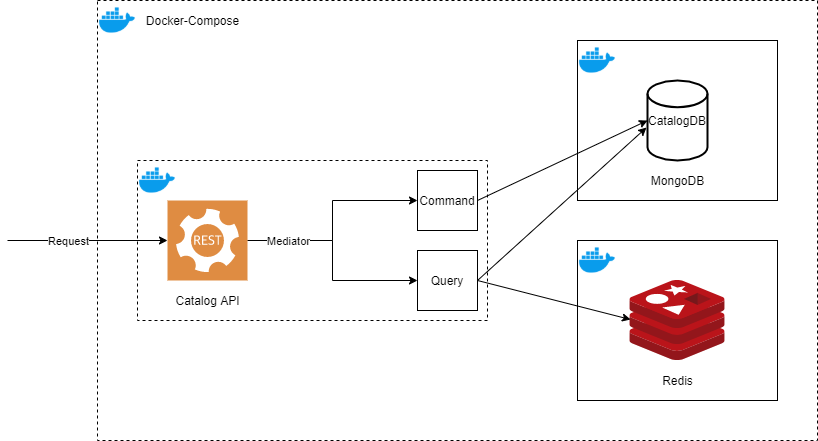
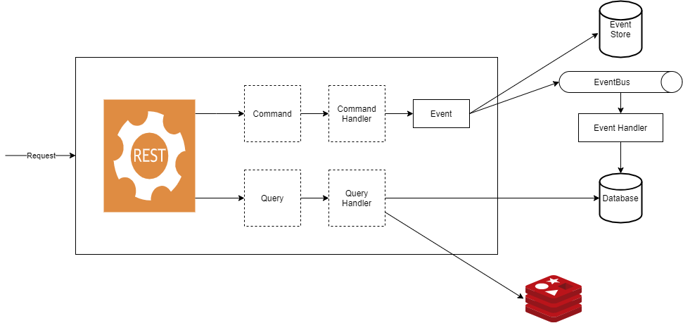

# Uygulama

Kategori ve ürün için REST standartlarına uygun API yazılması 

## Projeyi Çalıştırmak İçin

Projenin çalıştırılabilmesi için .NET 5 ya da Docker yüklü olmalıdır.

Docker ile projeyi çalıştırmak için herhangi bir terminal ile projenin /src klasöründe (docker-compose.yml dosyasının bulunduğu) sırasıyla aşağıdaki komutlar çalıştırılmalıdır.

```
docker-compose build
```

```
docker-compose up -d
```

Swagger Linki

```
http://localhost:5000/swagger/index.html
```

Projeyi durdurmak için

```
docker-compose down
```

### Kullanılan Teknolojiler ve Patternler

- .Net 5
- MongoDB
- Redis
- Docker
- AutoMapper
- Swagger
- Repository Pattern
- Mediator Pattern (MediatR ile)
- CQRS

### Örnek İstekler

Swagger üzerinden işlem yapılabilinir.
/src klasöründeki HYCaseStudy.postman_collection.json postman e import edilerek kullanılabilinir.

### Proje Mimarisi


### EventBus ile Birlikte Olması Gereken Mimari
